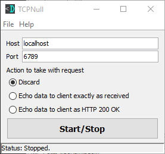

TCP Null
==================

TCP server that listens and discards or echos back the data to the client for
testing and debugging purposes.

Features
-------
1 checkboxes
2 logs

Download the JAR
----------------
* [TCP Null from DevDungeon.com](http://www.devdungeon.com/content/tcp-null)

Source Code
-----------
* [TcpNull (GitHub.com)](https://www.github.com/DevDungeon/TcpNull)

Running
-------
* Ensure Java 7 or greater is installed
* Double click the .jar file or run at the command line with:

`java -jar TcpNull-1.0.jar`

Contact
-------
NanoDano <nanodano@devdungeon.com>

License
-------
GNU General Public License, version 2 (See LICENSE.txt)

Changelog
---------
v1.0 - 2016/10/20 - Initial stable release.
